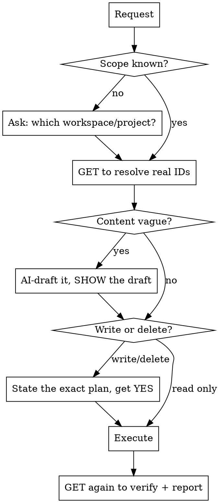

# agshub CRUD

## Overview

agshub is Alliance Global Solutions' work tracker (CodeIgniter 4 + Shield API, Vue SPA).
This skill lets you drive its full REST API accurately and safely: it gives you the exact
endpoints, the data model, and validation rules, plus a **confirm-before-you-fire** workflow
so you never guess a path, silently write bad data, or run an irreversible delete unprompted.

**Core principle:** Resolve real IDs → draft content with AI → **confirm the plan** → execute →
verify. Never guess an endpoint or an ID; never fire a write on ambiguous scope or any delete
without an explicit go-ahead.

- **Base URL:** `https://agshub.onrender.com` (all routes are under `/api`). Dev: `http://localhost:8080`.
- **Auth:** `Authorization: Bearer <token>` on every route except register/login/magic.
  Token = a personal API key from Settings, or `POST /api/auth/tokens`. Keep it out of URLs and logs.
- **Transport:** raw REST (curl / the `agshub.mjs` helper in this dir), or the agshub MCP tools
  (`mcp__agshub__*`) if the connector is attached — same operations, same rules below.

## The workflow (do this every time)



## Always confirm before firing (the questions to ask)

Ambiguity in any of these means **stop and ask** — a wrong answer writes to the wrong place or
destroys data:

1. **Which workspace?** If the token has >1 workspace and the user didn't name one, ask. Never
   assume. (Slug scopes everything.)
2. **Which project / item?** Match by name via a GET first. If a name matches 0 or >1 rows, stop
   and show what you found — never act on a guess.
3. **Any DELETE, or a destructive PATCH** (reassigning many items, clearing fields, moving many
   states): echo back exactly what will change (names + counts + IDs) and get an explicit YES.
   Deletes cascade (deleting a project removes its states, items, comments, activity).
4. **Enum / format values:** confirm the target when the user is loose — e.g. "done" → which
   `completed`-group state; "high priority" → `high` vs `urgent`.

Read-only GETs need no confirmation — run them freely to ground everything in real IDs.

## AI-generate content, then confirm (don't refuse, don't fabricate silently)

When a field is empty or the user asks for "good"/"detailed"/"well-written" content
(descriptions, overview, milestone names, titles), **draft it yourself** from real context
(the item's title, sibling items, the repo, the conversation) and **show the draft before
writing**. Don't ask the user to write it, and don't invent facts that aren't grounded.

- Ground drafts in evidence: read the work item title, related items, `CLAUDE.md`, recent
  commits, or the project's existing data. Prefer accurate over verbose.
- For bulk fills (e.g. "every task is missing a description"), draft all of them, show the list,
  confirm once, then write in a loop.
- `overview` and `description` render as **plain text** (whitespace-preserved), not markdown —
  structure with plain headings/indentation, not `#`/`*`.

## Data model (what scopes what)

`workspaces` → `workspace_members(role)` → `projects` → `states` (5 seeded, one per group) →
`work_items(state_id, priority, milestone_id, sort_order, due_date)` → `work_item_assignees` /
`work_item_labels`. Also under a project: `milestones`, `labels`. Under a workspace (not a
project): `members`, `chat`, and the **personal** `stickies` / `drafts` (private to you).

- **"Done" is not a status string** — it's `state_id` pointing at that project's state whose
  `group === 'completed'`. To "mark done", GET states, find the completed-group state, PATCH
  `state_id`. Same for backlog/unstarted/started/cancelled.
- **Milestone %** is computed server-side (completed items ÷ total assigned). You never set a
  percent — assign items and move their states; the number falls out. GET a milestone to read
  `total`/`completed`/`percent`.
- **Roles:** `admin` (full), `member` (read/write), `guest` (read-only — writes 403). Only an
  admin manages members. Non-membership returns **404** (not 403), to hide existence.

## Endpoint reference

Prefix every path with `https://agshub.onrender.com/api`. `{ws}` = workspace slug, `{p}` =
project UUID, `{id}` = resource UUID. All bodies are JSON.

| Area | Method & path | Body / notes |
|------|---------------|--------------|
| **Auth** | `GET /auth/me` | current user |
| | `POST /auth/tokens` | `{name}` → returns raw token **once**; store it |
| | `GET /auth/tokens` · `DELETE /auth/tokens/{numId}` | list / revoke personal keys |
| | `POST /auth/login` | `{email,password}` → token (unauth) |
| | `POST /auth/magic/request` · `/auth/magic/verify` | `{email}` / `{token}` — @allianceglobalsolutions.com only |
| **Workspaces** | `GET /workspaces` · `POST /workspaces` | create: `{name, slug}` |
| | `GET /workspaces/{ws}` | |
| **Members** | `GET /workspaces/{ws}/members` | admin only for writes |
| | `POST /workspaces/{ws}/members` | `{email, role}` role∈`admin,member,guest`; unknown @allianceglobalsolutions.com email is auto-provisioned + emailed a magic link |
| | `PATCH …/members/{userId}` `{role}` · `DELETE …/members/{userId}` | |
| **Projects** | `GET /workspaces/{ws}/projects` · `POST …/projects` | create: `{name, identifier}` — identifier `^[A-Z0-9]{1,10}$`, unique in ws; optional `description` |
| | `GET/PATCH/DELETE …/projects/{p}` | PATCH allows `name`, `description`, `overview` only |
| | `POST/DELETE …/projects/{p}/favorite` | per-user star |
| **States** | `GET …/projects/{p}/states` | 5 seeded per project |
| | `POST/PATCH/DELETE …/projects/{p}/states[/{id}]` | `{name, color, group, sort_order, wip_limit?}` group∈`backlog,unstarted,started,completed,cancelled` |
| **Labels** | `GET/POST/PATCH/DELETE …/projects/{p}/labels[/{id}]` | `{name, color}` |
| **Milestones** | `GET …/projects/{p}/milestones` | rows include `total,completed,percent` |
| | `POST/PATCH/DELETE …/projects/{p}/milestones[/{id}]` | `{name, due_date?}` (`Y-m-d`) |
| **Work items** | `GET /workspaces/{ws}/projects/{p}/work-items` | list |
| | `POST /workspaces/{ws}/projects/{p}/work-items` | `{title, description?, state_id?, priority?, due_date?, milestone_id?, assignee_ids?[], label_ids?[]}` — title required; defaults: first state, priority `none` |
| | `GET/PATCH/DELETE /workspaces/{ws}/projects/{p}/work-items/{id}` | item routes stay **nested under the project** — never `/workspaces/{ws}/work-items/{id}`. PATCH any create field |
| | `GET /workspaces/{ws}/projects/{p}/work-items/{id}/activity` | change log |
| **Comments** | `GET/POST/PATCH/DELETE /workspaces/{ws}/projects/{p}/work-items/{id}/comments[/{cid}]` | `{body}` — author edits own, admin any |
| **My Work** | `GET /workspaces/{ws}/my-work` | cross-project, assigned-to/created-by you |
| **Chat** | `GET/POST/PATCH/DELETE /workspaces/{ws}/chat[/{id}]` | `{body}` — one shared channel |
| **Stickies** | `GET/POST/PATCH/DELETE /workspaces/{ws}/stickies[/{id}]` | `{content, color, sort_order}` color∈`yellow,green,blue,pink,purple,orange,gray` — **private to you** |
| **Drafts** | `GET/POST/PATCH/DELETE /workspaces/{ws}/drafts[/{id}]` | `{title, description, priority, project_id?}` — **private to you** |

## Field rules & gotchas

- **`priority`** ∈ `none, low, medium, high, urgent`. **`due_date`** is `Y-m-d` or omit.
- **`assignee_ids` / `label_ids`** must be **arrays** when present (a scalar or `null` → 422).
  `[]` clears all. Assignees must be workspace members; labels must belong to the project.
- **PATCH semantics:** the API keys off `array_key_exists`, so sending `"field": null` for a
  NOT-NULL column is a **422**, not a silent NULL. Omit a field to leave it unchanged.
- **Error envelope:** `{"error": "..."}` for single failures, `{"errors": {field: msg}}` for
  validation (422). 404 can mean "not a member" — check the token's workspace.
- Prefer PATCH with only the fields you're changing; don't round-trip a whole object.

## Setup

Put the token in an env var (never inline in shared output):
```bash
export AGSHUB_TOKEN="<personal API key from Settings → API Keys>"
```
Quick check: `curl -s -H "Authorization: Bearer $AGSHUB_TOKEN" https://agshub.onrender.com/api/auth/me`

For scripted / bulk work use the helper in this directory — it wraps auth and JSON:
```bash
node agshub.mjs get  workspaces
node agshub.mjs get  "workspaces/<ws>/projects/<p>/work-items"
node agshub.mjs patch "workspaces/<ws>/projects/<p>/work-items/<id>" '{"description":"..."}'
```
Run `node agshub.mjs` with no args for usage. If the agshub MCP connector is attached instead,
use its `mcp__agshub__*` tools — the operations and rules are identical.

## Common mistakes

| Mistake | Fix |
|---------|-----|
| Guessing the path (`/items` vs `/work-items`, `/api` prefix) | Use the table. It's `/api/.../work-items`. |
| De-nesting an item route to `/workspaces/{ws}/work-items/{id}` | Item/comment/activity routes stay under `/projects/{p}/…`. |
| Treating "done" as a status field | PATCH `state_id` to the `completed`-group state (GET states first). |
| Sending `assignee_ids: "uuid"` or `null` | Must be an array; `[]` to clear. |
| PATCH `"state_id": null` to "unset" | 422 — omit the field instead. |
| Acting on a name without a GET | Names aren't unique/stable; resolve to a UUID first. |
| Firing a DELETE to "clean up" | Confirm names + counts + IDs first; deletes cascade. |
| Asking the user to write descriptions | Draft them yourself, show the draft, then confirm. |
| Inventing a workspace when >1 exists | Ask which one. |

## Red flags — STOP

- About to DELETE or bulk-reassign without an explicit YES.
- Using a name-matched row you haven't GET-confirmed is unique.
- Writing `null` into a required field, or a non-array into `assignee_ids`/`label_ids`.
- Guessing an endpoint or an ID instead of reading it from a GET or this table.
- Assuming a workspace/project the user never named.
