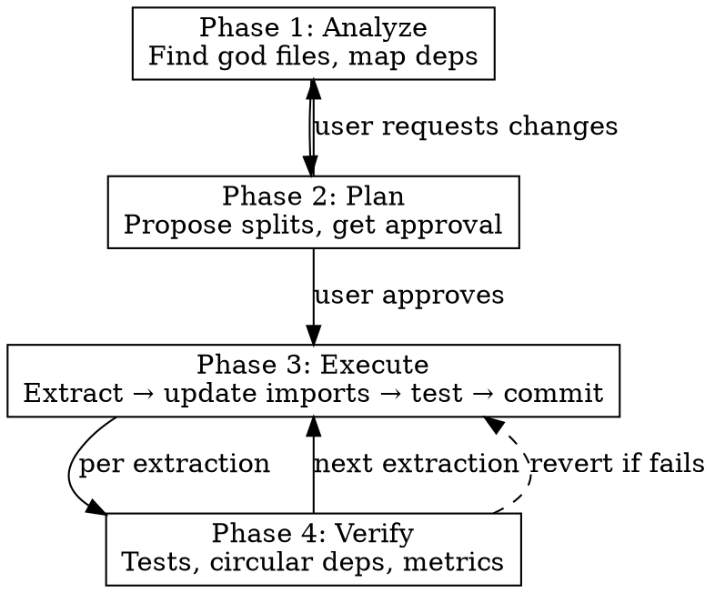

# Modularize: Execute File-Level Refactoring

Split multi-responsibility files into single-responsibility modules with safe import updates across the codebase.

**Announce at start:** "Using the modularize skill to refactor file structure."

## Scope Lock

All operations scoped to PROJECT_ROOT (current working directory). Never scan `node_modules/`, `.git/`, `dist/`, `build/`, `.next/`, `vendor/`, `__pycache__/`, `.venv/`, `coverage/`.

## The Iron Law

```
NO EXTRACTION WITHOUT VERIFIED TESTS BEFORE AND AFTER.
ONE COMMIT PER EXTRACTION FOR CLEAN ROLLBACK.
```

## When to Use

**Use when:**
- Code-audit Pass H identified god files, mixed concerns, or structural issues and user wants them FIXED
- User asks to split large files into single-responsibility modules
- Files have 300+ lines with multiple unrelated exports
- User wants domain-based folder reorganization
- Circular dependency chains need breaking
- Multiple functions keep breaking each other in the same file

**Don't use when:**
- Files are large but cohesive (single responsibility, tightly coupled internals)
- Splitting would create files with <10 lines of trivial code (over-fragmentation)
- No test suite exists (require user to add tests first or explicitly accept risk)
- User wants to understand structure but not change it (use code-audit instead)

## Four-Phase Process



---

### Phase 1: Analyze (Parallel-Safe)

Dispatch up to 3 parallel Explore subagents using `prompts/analyzer-prompt.md`. Each subagent scans a directory or module boundary.

**God file detection signals:**

| Signal | Threshold | Language |
|--------|-----------|----------|
| Line count | >300 lines | All |
| Named exports | >5 per file | TS/JS |
| Top-level functions | >5 per file | All |
| Classes | >1 per file | All |
| Mixed concerns | UI + API + business logic | TS/JS/Python |
| `def` count | >5 module-level functions | Python |
| Dump-drawer names | `helpers`, `utils`, `common`, `misc` | All |

**Dependency mapping (per god file):**
- List every file that imports from it (consumers)
- Identify what each consumer actually uses (named imports vs namespace)
- Detect circular import chains
- Count relative import depth (`../../../` = poor organization)

**Output:** Ranked list of god files by: (a) consumer count, (b) distinct responsibilities, (c) line count. Highest-impact files first.

See `references/analysis-checklist.md` for language-specific detection heuristics.

---

### Phase 2: Plan (Requires User Approval)

For each god file, produce a split proposal in this format:

```
## File: src/utils/helpers.ts (847 lines, 23 exports, 14 consumers)

### Proposed Extractions (ordered by dependency — extract leaves first):

1. EXTRACT: calculateTax, calculateDiscount, formatPrice
   → NEW FILE: src/pricing/calculateTax.ts
   → NEW FILE: src/pricing/calculateDiscount.ts
   → NEW FILE: src/pricing/formatPrice.ts
   CONSUMERS: src/checkout/Cart.tsx, src/admin/Reports.tsx

2. EXTRACT: validateEmail, validatePhone, sanitizeInput
   → NEW FILE: src/validation/validateEmail.ts
   → NEW FILE: src/validation/validatePhone.ts
   → NEW FILE: src/validation/sanitizeInput.ts
   CONSUMERS: src/forms/ContactForm.tsx, src/auth/Register.tsx

3. KEEP IN PLACE: [functions too tightly coupled to split]
   REASON: These functions share internal state and call each other

### Barrel File Decision:
- Project uses barrel exports: YES/NO
- If YES: Update existing index.ts to re-export from new locations
- If NO: Do NOT create new barrel files — update consumer imports directly

### Risk Assessment:
- Circular dependency risk: LOW/MEDIUM/HIGH
- Breaking change risk: LOW/MEDIUM/HIGH (based on consumer count)
```

**Present to user. Do NOT proceed without explicit approval.**

**Naming rules:**
- File named after its primary export: `calculateTax.ts` exports `calculateTax`
- Domain folder named after the business domain: `pricing/`, `validation/`, `auth/`
- NEVER name target files `helpers.ts`, `utils.ts`, `common.ts`, `misc.ts`

**Extraction order:** Extract leaf dependencies first (functions that don't import from other functions being extracted). This prevents intermediate broken states.

---

### Phase 3: Execute (Sequential, One Extraction at a Time)

For each extraction in the approved plan:

1. **Baseline test run.** Run full test suite. Must pass. If not, STOP.
2. **Create new file** with the extracted function/class and its direct imports
3. **Update source file** — remove extracted code. Add import from new location if source still references it
4. **Update ALL consumers** — Grep project-wide for every file importing the extracted symbol from the old path. Update each one.
5. **Handle barrel files:**
   - Project already uses barrels → update existing barrels to re-export from new location
   - Project doesn't use barrels → skip, consumers import directly
   - NEVER create new barrel files unless user explicitly requests them
6. **Run test suite.** Must pass.
7. **Commit:** `refactor: extract [functionName] to [new/path]`
8. **If tests fail:** `git revert HEAD`, report which extraction failed and why, ask user how to proceed

**Import update patterns (TypeScript/JavaScript):**

```
# Standard named import
import { extractedName } from 'old/path'
→ import { extractedName } from 'new/path'

# Mixed import (some symbols stay, some move)
import { extractedName, otherThing } from 'old/path'
→ import { extractedName } from 'new/path'
  import { otherThing } from 'old/path'

# CommonJS require
const { extractedName } = require('old/path')
→ const { extractedName } = require('new/path')

# Namespace import — CAREFUL
import * as utils from 'old/path'  // uses utils.extractedName
→ import { extractedName } from 'new/path'
  import * as utils from 'old/path'  // if still uses other utils.X

# Dynamic import — SEARCH for string literals
import('old/path')  // check for these too
```

**Import update patterns (Python):**

```
# Standard import
from old.module import extracted_name
→ from new.module import extracted_name

# Module import
import old.module  # uses old.module.extracted_name
→ from new.module import extracted_name

# Wildcard — CAREFUL
from old.module import *
→ Flag for manual review (wildcard hides which symbols are used)
```

**Cross-cutting code extraction order:**
1. Shared utilities used by many files (auth, logging, validation)
2. Domain-specific business logic
3. UI components with mixed concerns
4. Route handlers with embedded logic

---

### Phase 4: Verify (After All Extractions Complete)

Run all verification checks. Use `prompts/verifier-prompt.md` for subagent dispatch.

1. **Full test suite** — all tests pass (MANDATORY)
2. **Circular dependency check:**
   - TypeScript: `npx madge --circular --extensions ts,tsx src/`
   - JavaScript: `npx madge --circular src/`
   - Python: `python -m pydeps --no-output --show-cycles src/`
   - Fallback: Grep for any file A importing from B where B imports from A
3. **Dead code check** — files no longer imported by anything
4. **Stale imports** — no remaining imports pointing to old locations for moved symbols
5. **Type checking** — `npx tsc --noEmit` (TS) or `mypy src/` (Python)
6. **Build verification** — run project build command if one exists

**Before/after summary (present to user):**

```
| Metric | Before | After |
|--------|--------|-------|
| God files (>300 lines) | X | Y |
| Avg exports per file | X | Y |
| Circular dependencies | X | Y |
| Files changed | — | N |
| New files created | — | N |
| Tests | N pass | N pass |
```

See `references/circular-dependency-guide.md` for resolution patterns.

---

## Safety Rails

**NEVER split when:**
- Two functions share mutable state (closures over same variable, class methods sharing `this`)
- Functions are only meaningful together (event handler + its registration, route + middleware)
- Splitting would require passing >3 new parameters to maintain the same behavior
- The result would be a file under 10 lines with no meaningful logic
- The file is a generated file or framework convention (`_app.tsx`, `middleware.ts`, `__init__.py`)

**STOP and ask user when:**
- A file has >20 consumers (high blast radius)
- Circular dependency would be created by proposed split
- Tests import directly from the file being split (test files need updates too)
- Dynamic imports (`import()`, `__import__()`) reference the file
- No test suite exists for the affected code

## Barrel File Policy

**Default: Follow existing project conventions.**

| Situation | Action |
|-----------|--------|
| Project uses barrel files | Update existing barrels, don't create new ones |
| Project doesn't use barrels | Do NOT introduce them |
| User explicitly requests barrels | Create them, warn about build performance |
| Existing barrels are bloated | Flag for review, don't auto-restructure |

**Why cautious:** Atlassian removed barrel files and saw 75% faster builds. Barrels defeat tree-shaking, create hidden dependency chains, and make circular deps harder to detect.

## Red Flags — STOP Immediately

- Extracting without running tests first
- Updating imports with blind find-and-replace
- Creating barrel files in a project that doesn't use them
- Splitting a file that has no tests (without user's explicit acceptance of risk)
- Naming extracted files `helpers.ts`, `utils.ts`, `common.ts`, `misc.ts`
- Making more than one extraction between test runs
- Continuing after a test failure without reverting
- Splitting framework convention files without understanding implications

## Common Mistakes

| Mistake | Fix |
|---------|-----|
| Miss a consumer of the old import | Grep project-wide for old import path BEFORE committing |
| Create circular dep | Map dependency graph FIRST, extract leaves first |
| Over-fragment into 50 tiny files | 1-export-per-file is a GUIDELINE, not a mandate. Group related functions in domain folders |
| Break dynamic imports | Search for string literals matching old path: `import('old/path')` |
| Miss re-exports through barrels | Check all `index.ts`/`__init__.py` files that re-export from the target |
| Namespace import breakage | `import * as X` requires checking all `X.member` usages |
| Break test imports | Tests are consumers too — update their imports |
| Forget type exports | Types/interfaces imported from the old file need moving too |

## Integration

**Workflow skills:**
- `verification-before-completion` — gate every extraction with test verification
- `using-git-worktrees` — isolate refactoring from main branch (recommended for large refactors)

**Related skills:**
- `code-audit` Pass H — identifies structural issues this skill fixes
- `test-driven-development` — for adding missing tests before modularizing
- `dispatching-parallel-agents` — for Phase 1 parallel analysis

**Subagent prompts:**
- `prompts/analyzer-prompt.md` — Phase 1 god file analysis
- `prompts/extractor-prompt.md` — Phase 3 single extraction
- `prompts/verifier-prompt.md` — Phase 4 verification checks
