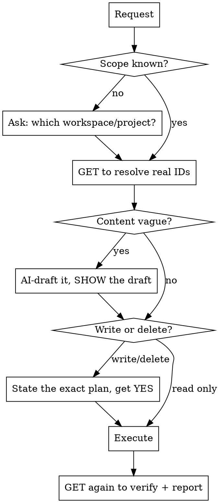

# waypoint CRUD

## Overview

waypoint is Vincent's own clean-room work-management platform (CodeIgniter 4 + Shield API,
Vue 3 SPA) — see `~/Desktop/REPOSITORY/waypoint/CLAUDE.md` for the full architecture. This skill
is the personal-projects counterpart to `agshub-crud`: same confirm-before-you-fire discipline,
adapted to waypoint's actual routes and quirks (which differ from agshub's in real, source-verified
ways — read the gotchas section, don't assume parity).

**Core principle:** Resolve real IDs → draft content with AI → **confirm the plan** → execute →
verify. Never guess an endpoint or an ID; never fire a write on ambiguous scope or any delete
without an explicit go-ahead.

- **Base URL:** `https://macbook-pro.tail7ceefe.ts.net:10000` (Tailscale Funnel → the local Docker
  stack's `:8080`, always up per the container restart policy). Local/dev: `http://localhost:8080`
  (`php spark serve` or `docker compose up`). There is **no Render deployment** for this instance —
  don't assume an `.onrender.com` URL. All routes are under `/api`.
- **Auth:** `Authorization: Bearer <token>` on every route except `auth/register`, `auth/login`,
  `auth/magic/request`, `auth/magic/verify`, `health`, and `downloads/{filename}` (deliberately
  unauthenticated — installer binaries aren't sensitive). Token = a personal API key from
  Settings → API Keys, or `POST /api/auth/tokens`. Keep it out of URLs and logs.
- **Registration is closed**, not open like agshub — `POST /auth/register` requires a valid
  `invite_code` minted by a workspace admin (`POST /workspaces/{slug}/invite-codes`); there's no
  domain-based self-signup path. Magic-link sign-in (`/auth/magic/*`) is hard-locked to a single
  allowlisted address (`vjrodriguez1994@gmail.com`) — don't expect it to work for anyone else, and
  don't "fix" that allowlist without being asked; it's intentional (see repo CLAUDE.md).
- **Transport:** raw REST (curl / the `waypoint.mjs` helper in this dir). There's no MCP connector
  wired up for this personally-hosted instance the way agshub has one — use the helper or curl.

## The workflow (do this every time)



## Always confirm before firing (the questions to ask)

Ambiguity in any of these means **stop and ask** — a wrong answer writes to the wrong place or
destroys data:

1. **Which workspace?** If the token has >1 workspace and the user didn't name one, ask. Never
   assume. (Slug scopes everything.)
2. **Which project / item?** Match by name via a GET first. If a name matches 0 or >1 rows, stop
   and show what you found — never act on a guess.
3. **Any DELETE, or a destructive PATCH** (reassigning many items, clearing fields, moving many
   states, revoking an invite code, removing a member): echo back exactly what will change (names
   + counts + IDs) and get an explicit YES. Deletes cascade — deleting a project removes its
   states/labels/work items/attachments/activity; deleting a workspace cascades everything under it.
   **Narrow exception:** deleting content the assistant itself created earlier in the *same*
   conversation, in direct response to the user's own corrective feedback on that content (e.g.
   "these tasks aren't good enough, redo them") — stating the plan/counts is enough there, a
   separate round-trip "yes" is friction when the user's message already is the go-ahead. Anything
   not created this same conversation, or any unprompted/ambiguous delete, still needs the explicit YES.
4. **Enum / format values:** confirm the target when the user is loose — e.g. "done" → which
   `completed`-group state; "high priority" → `high` vs `urgent`; "at risk" → `health` enum value.
5. **Admin-only actions** (workspace settings, member add/remove/role-change, invite codes,
   workspace delete): confirm the caller's token actually has `admin` role first (`GET
   /workspaces/{slug}` returns your `role`) — these 403 for `member`/`guest` even with
   `requireWrite` otherwise satisfied.

Read-only GETs need no confirmation — run them freely to ground everything in real IDs.

## AI-generate content, then confirm (don't refuse, don't fabricate silently)

When a field is empty or the user asks for "good"/"detailed"/"well-written" content
(descriptions, overview, milestone names, titles), **draft it yourself** from real context
(the item's title, sibling items, the repo, the conversation) and **show the draft before
writing**. Don't ask the user to write it, and don't invent facts that aren't grounded.

- Ground drafts in evidence: read the work item title, related items, `CLAUDE.md`, recent
  commits, or the project's existing data. Prefer accurate over verbose.
- For bulk fills (e.g. "every task is missing a description"), draft all of them, show the list,
  confirm once, then write in a loop.
- `overview` (project) renders as **plain text**, not markdown — structure with plain
  headings/indentation, not `#`/`*`. Work-item `description`/`label_ids` are patchable (see gotchas).
- **"Comprehensive" is a bar the operator checks by direct inspection, not just internal
  accuracy** — confirmed repeatedly across every artifact type (14-15 Aug 2026):
  - *Project overview* needs more than scope + financials — a RESOURCES block (repo/host
    locations, related sibling projects, key source docs) and a status summary
    (completed/ongoing/backlog counts), or it reads as incomplete even with every fact accurate.
  - *Work-item breakdown* needs more than a title + hours estimate — every item needs a real
    description with grounded rationale/acceptance-criteria (not `"Part of {milestone}, {N}h"`),
    at least one label, and a schedule padded for discovery/review/QA/documentation time, not just
    raw build hours. A task list flagged as "too short" on inspection usually means the *hour
    estimates* were compressed, not that there aren't enough tasks. When a user flags an existing
    batch this way, a scripted delete+rebuild of that scope (see the confirm-before-delete
    exception above) beats trying to PATCH dozens of items into substantially different
    titles/granularity.
  - **Time & motion (`due_date`) is part of "comprehensive," not an optional extra, and covers
    EVERY item — completed, started, backlog, and todo alike** — flagged 15 Aug 2026 after a whole
    project's worth of items sat with zero `due_date`s, so nothing ever showed on the Calendar
    view. Two different kinds of date apply, and they must never be blurred together:
    - **Completed items → an evidenced historical date.** Pull it from the item's own description
      ("Verified/Fixed on X"), a cited git commit, a merged PR (`gh pr list --state merged` /
      `docs/CHANGELOG.md` — see below), or an audit date. Never leave a Done item undated, and
      never invent this one — it's a claim about the past, so it needs real evidence or it stays
      blank (see the confirmed batch on 15 Aug 2026: 5 undated items across WEB/OCA/MC/SCRM stayed
      correctly undated because no real evidence existed).
    - **Started/backlog/todo items → a planned target date via time-and-motion estimation.**
      Confirmed 15 Aug 2026: rather than leaving open work undated by default, estimate realistic
      effort using **traditional-manual-developer pacing** — discovery + implementation + testing
      + review, not raw build hours, and explicitly NOT an AI-accelerated turnaround estimate. The
      operator's own rationale: undervaluing effort as "AI makes this trivial" reads as
      undervaluing the engagement to a client who's paying for outcomes, not agent-hours. Rough
      tiers that held up in practice: XS/config-or-redeploy = 1 business day, S/isolated fix or
      run-existing-script = 2 days, M/multi-file feature or new integration = 4 days, L/cross-
      system or security-critical = 7 days. Sequence items within a project by priority
      (urgent → high → medium → low), stacking business days (skip weekends) from the next
      business day, respecting real dependencies (an item blocked on another item's decision is
      scheduled after it, not in parallel). Handle these sub-cases distinctly, not as generic dev
      work: **ongoing/recurring-cadence items** (no real "done") get a periodic review checkpoint,
      not a completion date; **items genuinely blocked on someone else's action** (a client's
      confirmation, an external system) get a near-term check-in date, not a promised completion;
      **pure decision items** (no code, just a call to make) get a short 1-2 day window, not a
      multi-day dev estimate; **off-contract/parked items with no real commitment to do the work**
      stay undated — scheduling a parked decision would itself be the fabrication this rule exists
      to prevent.
    - **Tag every estimated (not evidenced) date in the item's own description**, e.g. `[Time &
      motion: <1-line rationale>. Estimated using traditional-manual-developer pacing — a
      target/planned date, not a verified completion. Scheduled <today>.]` — appended to the
      existing description, never overwriting it. This is the load-bearing distinction: the
      Calendar view shows one `due_date` field with no "type," so without this tag a target
      estimate is visually indistinguishable from a verified historical fact. Never let that
      ambiguity stand.
    - Report which items were left genuinely undated and why, rather than silently skipping them.
  - **Best evidence source for a code-repo-backed project: the repo's own `docs/CHANGELOG.md`
    (if it exists) or `gh pr list --state merged` merge dates, matched to each item's title** —
    confirmed 15 Aug 2026 backfilling 38 undated completed items on the WEB project in one pass
    this way (vs. per-item guessing). Cross-check a sample against `gh pr view <n> --json
    mergedAt` independently before trusting a bulk claim of "N/N dated" — a batch that reports
    100% success on a large N is exactly the kind of surprising-positive result the workspace's
    Data Integrity rules say to spot-verify, not just relay.
  - **Before trusting an already-dated batch of completed items as "already comprehensive," spot-
    check 2-3 for real grounding** rather than assuming a shared date (e.g. several items all
    dated to the same day) is a lazy blanket default — it may be genuine (a real audit/fix session
    that day). Check each candidate's own description for an item-specific claim ("verified X",
    distinct test counts/findings) and, where available, cross-validate against a git commit at
    that date — matching, non-generic descriptions are the signal it's real, not copy-pasted.

## Comprehensive-update checklist — every surface, every call

The operator has repeatedly caught information left out of one surface while another got updated
(15 Aug 2026) — because a Waypoint project isn't just work-items, it's five surfaces that each need
their own explicit write. **Whenever this skill does a project-level update ("update the X
project", "make sure everything's comprehensive"), run through all five before calling it done —
don't stop once work-items look right:**

| Surface | Fed by | What "done" means |
|---|---|---|
| **List / Board** | `work_items` | Every item has `description`, `label_ids`, correct `state_id`, `priority` — not just a title. |
| **Calendar** | `work_items.due_date` | Every item is dated — completed with evidenced history, open work (started/backlog/todo) with a time-and-motion-estimated target (see the rule above); nothing that should show on a calendar is silently blank except genuinely parked/off-contract items. |
| **Activity** | `posts` (+ system events) | A real dated post narrates what changed *this pass*, referencing item numbers/PRs/evidence — not just the item edits themselves, which are silent unless they're a genuine state transition (see the "creates in completed state fire no event" gotcha below). |
| **Resources** | `attachments` | Any docs/PDFs generated for this project are actually uploaded and verified via a fresh `GET .../attachments` — check the list is current, don't assume a prior upload is still the latest. |
| **Milestones** | `milestones` + `work_items.milestone_id` | Every substantial theme of work has a milestone, and every item that belongs to one is actually linked (`milestone_id` set) — an item can look "grouped" by its title alone while its `milestone_id` is still `null`. |

**When touching an EXISTING item, refresh it holistically, not just the one field the user
mentioned.** If asked to fix a task's due date, take the extra beat to also check its description
is still accurate, it still has a label, and its milestone link is still right — the operator has
had to re-ask for the same project multiple times because each pass only fixed the one thing named,
leaving the rest to drift. A comprehensive update pass ends with a **fresh GET across all five
surfaces**, not just the one that was directly edited.

**Always end a bulk/multi-item pass with a written inventory report — don't just summarize
counts.** Confirmed 15 Aug 2026: after a 4-project, 81-item due-date backfill, the operator's
explicit ask was "give me a list of inventory of all the task that you move and update, including
all other details... so i would know if you did the right thing" — a rolled-up count ("38/38
dated") isn't enough for the operator to actually audit the work; they need to see each item.
Every bulk pass (due-date backfill, description fills, label sweeps, state-migration passes —
anything touching more than a handful of items) must produce, unprompted, a full per-item table:
item ID, title, the field(s) changed, old → new value, and the exact evidence used (PR number +
merge date, commit hash, cited source) — plus a clearly separated list of items deliberately left
unchanged with the reason (never fabricated, never silently skipped). Write it as a file when the
item count is large enough that an inline chat table would be unwieldy (roughly 20+ rows) — the
operator can then spot-check any row against the live app without having to trust the summary.

## Data model (what scopes what)

`workspaces` → `workspace_members(role: admin/member/guest)` → `projects` → `states` (5 seeded,
one per group, via `DEFAULT_STATES`) → `work_items(state_id, priority, milestone_id, sort_order,
due_date)` → `work_item_assignees` / `work_item_labels`. Also under a project: `milestones`
(computed progress, never stored), `labels`, `attachments` (10MB, MIME-allowlisted), and an
`activity` feed merging `posts`+`project_events`. Under a workspace (not a project): `members`,
`invite_codes` (admin-only), `chat` (one shared channel, can attach a work item), `notifications`
(cross-project, capped at 50), `my-work` (cross-project assigned-to/created-by), and the
**personal** `stickies` / `drafts` (private to you — not even an admin can see another user's).

- **"Done" is not a status string** — it's `state_id` pointing at that project's state whose
  `group === 'completed'`. To "mark done", GET states, find the completed-group state, PATCH
  `state_id`. Same for backlog/unstarted/started/cancelled. A genuine transition **into**
  completed also silently fires system events (`item_completed`, and `milestone_completed` if it
  was the last item on its milestone) that show up in the project activity feed as `kind: 'event'`
  — you don't create these, they're a side effect.
- **Milestone %** is computed server-side on every read (completed items ÷ total assigned,
  rounded). You never set a percent — assign items and move their states; the number falls out.
- **Roles:** `admin` (full + workspace settings/members/invites), `member` (project/item read-write
  via `requireWrite`), `guest` (read-only — writes 403). Non-membership returns **404** (not 403),
  to hide existence. Losing the **last** admin is blocked app-side (demote/remove/leave all 422).

## Endpoint reference

Prefix every path with `<base>/api`. `{ws}` = workspace slug, `{p}` = project UUID, `{id}` /
`{cid}` = resource UUID. All bodies are JSON except attachment upload (multipart).

| Area | Method & path | Body / notes |
|------|---------------|--------------|
| **Auth** | `POST /auth/register` | `{email, password(min 8), name, invite_code}` — unauth, invite-gated; `invite_code` is normalized server-side (dashes/spaces stripped, uppercased) so a pasted code like `5gwa-ydf3-73q4` redeems the same as `5GWAYDF373Q4` |
| | `POST /auth/login` | `{email, password}` — unauth, throttled 5/15min (email-keyed) |
| | `POST /auth/magic/request` · `/auth/magic/verify` | `{email}` / `{token}` — locked to one allowlisted address |
| | `GET /auth/me` · `PATCH /auth/me` | PATCH: `name, theme(light/dark/system), notify_chat, notify_mentions, notify_assignments, auto_update, launch_at_startup` — all optional, all booleans must be real JSON `true`/`false` |
| | `POST /auth/password` | `{current_password, new_password(min 8)}` |
| | `POST /auth/logout` | revokes only the bearer token used for *this* call |
| | `POST /auth/onboarding/complete` | no body — sets `onboarded_at` |
| | `GET/POST /auth/tokens` · `DELETE /auth/tokens/{numId}` | `POST {name}` → raw token shown **once**; `GET` lists **every** token including the `'web'` login token (no filtering) |
| **Workspaces** | `GET/POST /workspaces` | create: `{name, slug}` slug regex `^[a-z0-9-]{2,60}$` |
| | `GET/PATCH/DELETE /workspaces/{ws}` | PATCH+DELETE **admin-only**; PATCH `{name, github_repo?}` |
| | `POST /workspaces/{ws}/leave` | any role; blocked if you're the sole admin |
| **Members** | `GET /workspaces/{ws}/members` | any member |
| | `POST /members` | **admin-only** `{email, role}` — unknown email 422s unless a workspace domain allowlist is configured (empty by default) |
| | `PATCH …/members/{userId}` `{role}` · `DELETE …/members/{userId}` | admin-only; both block touching the **last admin** |
| **Invite codes** | `GET/POST /workspaces/{ws}/invite-codes` | **admin-only**; create `{role, max_uses?, expires_at?}` — response includes the raw `code` (not a secret, shareable) |
| | `DELETE …/invite-codes/{code}` | admin-only; **soft** revoke (`revoked_at`), row stays |
| **Projects** | `GET/POST /workspaces/{ws}/projects` | create: `{name, identifier}` — identifier `^[A-Z0-9]{1,10}$`, unique in ws, becomes the `PROJ-42` prefix; optional `description` |
| | `GET/PATCH/DELETE …/projects/{p}` | PATCH: `name, description, overview, health(on_track/at_risk/blocked, nullable)` only |
| | `POST/DELETE …/projects/{p}/favorite` | per-user star, both idempotent no-ops |
| **States** | `GET …/projects/{p}/states` | 5 seeded per project |
| | `POST/PATCH/DELETE …/projects/{p}/states[/{id}]` | `{name, color(#hex), group, sort_order, wip_limit?}` — DELETE blocked if it's the last state or any item still references it |
| **Labels** | `GET/POST/PATCH/DELETE …/projects/{p}/labels[/{id}]` | `{name, color(#hex)}` — neither field nullable on PATCH |
| **Milestones** | `GET …/projects/{p}/milestones` | rows include computed `total, completed, percent` |
| | `POST/PATCH/DELETE …/milestones[/{id}]` | `{name, description?, due_date?(Y-m-d)}`; DELETE nulls `milestone_id` on referencing items, doesn't cascade-delete them |
| **Attachments** | `GET/POST …/projects/{p}/attachments` | POST is **multipart** field `file`, app says 10MB cap, MIME allowlist (png/jpeg/gif/webp/pdf/txt/zip/doc/docx/xls/xlsx) — **but the server's actual PHP `upload_max_filesize` was observed at ~2MB on 14 Aug 2026** (PHP's own factory default, below the app's stated cap) — a file over ~2MB silently gets dropped from `$_FILES` before the app ever validates it, surfacing as `{"errors":{"file":"file is not a valid uploaded file."}}` regardless of MIME/size correctness. Binary-search down from a small known-good file if you hit this; don't assume the file itself is bad. No video MIME type in the allowlist at all — zip a video file to get it through as `application/zip` |
| | `GET …/attachments/{id}` (download) · `DELETE …/attachments/{id}` | GET streams raw bytes, `nosniff` header |
| **Activity/Posts** | `GET …/projects/{p}/activity` | merged `posts`+system-`events` feed, `?before=<created_at>|<id>` cursor, **no `has_more` flag** — infer from a full page of 20 |
| | `POST …/posts` · `PATCH/DELETE …/posts/{id}` | `{body, mentioned_user_ids?}` — edit is **author-only, no admin override**; delete is author-or-admin |
| | `POST/DELETE …/posts/{id}/like` | idempotent no-ops |
| | `GET/POST …/posts/{id}/comments` · `PATCH/DELETE …/comments/{cid}` | same author-only(edit)/author-or-admin(delete) split |
| **Work items** | `GET …/projects/{p}/work-items` | list — `git_status` here is **cache-only**, never a live GitHub call |
| | `POST …/work-items` | `{title, description?, state_id?, priority?, due_date?, assignee_ids?[], label_ids?[]}` — `milestone_id` is **not settable on create**, always inserted null |
| | `GET/PATCH/DELETE …/work-items/{id}` | item routes stay **nested under the project** — never `/workspaces/{ws}/work-items/{id}`. GET's `git_status` calls GitHub live if its cache is >300s stale |
| | `GET …/work-items/{id}/activity` | change log, oldest-first, **no pagination** — full history every call |
| **Comments** | `GET/POST/PATCH/DELETE …/work-items/{id}/comments[/{cid}]` | `{body}` (max 4000) — author edits own, admin any. **No @mention notifications fire here** (unlike chat/posts) |
| **My Work** | `GET /workspaces/{ws}/my-work` | cross-project; an item both assigned-to *and* created-by you appears in **both** `assigned[]` and `created[]` |
| **Notifications** | `GET /workspaces/{ws}/notifications` | `{items, unread_count}`, hard-capped at **50**, no further pagination |
| | `POST …/notifications/read` · `POST …/notifications/{id}/read` | mark-all / mark-one |
| **Chat** | `GET/POST/PATCH/DELETE /workspaces/{ws}/chat[/{id}]` | `{body, attached_work_item_id?}` — `body` only required if no attachment; `?before=` cursor, response **does** include `has_more`; edit is author-only |
| **Stickies** | `GET/POST/PATCH/DELETE /workspaces/{ws}/stickies[/{id}]` | `{content, color, sort_order}` color∈`yellow,green,blue,pink,purple,orange,gray` — **strictly owner-only, no admin override at all** |
| **Drafts** | `GET/POST/PATCH/DELETE /workspaces/{ws}/drafts[/{id}]` | `{title, description, priority, project_id?}` — owner-only same as stickies |
| **Downloads** | `GET /downloads/{filename}` | **unauthenticated**; `filename=latest` → newest `.exe` GitHub Release asset |

## Field rules & gotchas (source-verified, not assumed)

- **`priority`** ∈ `none, low, medium, high, urgent`. **`due_date`** is `Y-m-d` or omit.
  **`health`** (project only) ∈ `on_track, at_risk, blocked`, nullable.
- **`assignee_ids` / `label_ids`** must be **arrays** when present (a scalar or bare string → 422
  "Must be an array of ids"). `[]` clears all. Assignees must be workspace members; labels must
  belong to the project.
- **Work-item PATCH accepts `description` and `label_ids`**, combinable with other patchable
  fields in one request (verified 14 Aug 2026 via re-GET, not just the PATCH echo — trust a fresh
  GET over the response body on any future field you're unsure about).
- **PATCH semantics app-wide:** the API keys off `array_key_exists`, so sending `"field": null` on
  a NOT-NULL/required column is a **422**, not a silent NULL (e.g. `title`, `state_id`, `priority`,
  `sort_order`, state's `name`/`color`/`group`, label's `name`/`color`, sticky's `color`). Nullable
  columns (`due_date`, `milestone_id`, sticky's `content`, draft's `description`/`project_id`,
  state's `wip_limit`) accept explicit `null` to clear. Omit a field entirely to leave it unchanged.
  On `PATCH /projects/{p}`, `health: ""` and `health: null` both clear it — there's no way to 422
  an invalid *empty* value there, only an invalid non-empty one.
- **`milestone_id` on work items:** not settable on `POST` (create) at all — always null; set it
  via a follow-up `PATCH`. On PATCH, a non-null value must belong to the same project (422
  otherwise); explicit `null` clears it without a check.
- **Boolean fields on `PATCH /auth/me`** (`notify_*`, `auto_update`, `launch_at_startup`) must be
  real JSON `true`/`false` — anything else (a string `"true"`, `1`) → 422 "must be true or false".
- **Last-admin protections:** demoting/removing the last workspace admin, or that admin leaving,
  are all blocked with a 422 — you cannot orphan a workspace this way even by accident.
- **Error envelope:** `{"error": "..."}` for single failures, `{"errors": {field: msg}}` for
  validation (422) — including the sentinel `{"errors": {"_": "Nothing to update"}}` when a PATCH
  body has none of the patchable keys. 404 can mean "not a member" — check the token's workspace.
- **Idempotent, not error-prone:** favorite/unfavorite and post like/unlike are safe to repeat —
  they 200 as no-ops rather than 409/422 on a redundant call.
- **Author-only vs author-or-admin varies by resource** — don't assume uniform admin override:
  project-post/comment and chat-message **edit** is strictly author-only (even an admin can't fix
  someone else's typo via PATCH); **delete** is author-or-admin on posts/comments/chat. Stickies
  and drafts have **no admin override at all**, edit or delete.
- **Invite-code redemption is the one atomic (row-locked) write in the whole API** — a
  conditioned `UPDATE ... WHERE revoked_at IS NULL AND not-expired AND under max_uses` guards the
  race where two people redeem the last use simultaneously. Everything else that "checks then
  writes" (favorites, likes, last-admin checks) is a plain read-then-write — fine for a
  single-user personal instance, just don't assume DB-level guarantees exist elsewhere.
- Prefer PATCH with only the fields you're changing; don't round-trip a whole object.
- **`curl -d ...` without an explicit `-X PATCH` silently 404s on any PATCH-only route** (curl
  defaults to POST when `-d` is given; there's no POST route on `/work-items/{id}`, `/projects/{p}`,
  etc., so it 404s instead of erroring descriptively) — confirmed 14 Aug 2026: a milestone-link PATCH
  returned `{"error":...}` 404 with the exact same URL that GET'd fine seconds earlier. Always pass
  `-X PATCH` explicitly on every update call; never rely on `-d` alone to imply the method.
- **Creating a work item already in a `completed`-group state fires NO activity event** — only a
  genuine state *transition* via PATCH does (`item_completed`), and only milestone/project-level
  creates fire their own creation events. Bulk-seeding historical work directly into `completed`
  (e.g. importing already-finished tasks) leaves the Activity tab looking mechanical/empty except
  for milestone-creation noise — confirmed 14 Aug 2026, caught by direct operator inspection of the
  live UI after a 68-item seed showed only 10/3/4 "milestone_created" events, zero real narrative.
  **Fix: POST real `posts` narrating what actually happened.** Since `POST .../posts` can't backdate
  `created_at`, put the real historical date explicitly in the post body (`"[2026-07-23] ..."`)
  rather than relying on the timestamp, which will just show today.

## Setup

`WAYPOINT_TOKEN`/`WAYPOINT_BASE_URL` are already persisted in `~/.zshrc` — check there first
(`grep WAYPOINT ~/.zshrc`) before minting a new token. **Being in `~/.zshrc` does NOT mean a fresh
Bash tool call has them set** — confirmed 14 Aug 2026: a call made right after appending the
`export` lines to `~/.zshrc` still failed (`curl: URL rejected: No host part in the URL`) because
this harness's Bash tool doesn't source the profile per call. **Inline-export at the start of every
waypoint call, every time** — don't assume the `~/.zshrc` entry alone is enough once it exists:
```bash
cat >> ~/.zshrc <<'RC'
export WAYPOINT_TOKEN="<personal API key from Settings → API Keys>"
export WAYPOINT_BASE_URL="https://macbook-pro.tail7ceefe.ts.net:10000"   # or http://localhost:8080 for local dev
RC
```
Quick check: `curl -sk -H "Authorization: Bearer $WAYPOINT_TOKEN" "$WAYPOINT_BASE_URL/api/auth/me"`
— confirmed working against the live Tailscale Funnel endpoint (2026-08-14).

For scripted / bulk work use the helper in this directory — it wraps auth and JSON:
```bash
node waypoint.mjs get  workspaces
node waypoint.mjs get  "workspaces/<ws>/projects/<p>/work-items"
node waypoint.mjs patch "workspaces/<ws>/projects/<p>/work-items/<id>" '{"priority":"high"}'
```
Run `node waypoint.mjs` with no args for usage. There is no attached MCP connector for this
instance today, so all writes go through this helper or curl — never guess a fetch call inline
without checking the endpoint table above first. **For 50+ writes in one pass** (e.g. seeding a
new project's full history), write a dedicated one-off Node script reusing this same fetch/auth
pattern rather than looping the CLI helper call-by-call — one process is faster and the script
itself is the audit trail of exactly what got written (confirmed effective 14 Aug 2026: ~150
requests across create/patch/label/post for a 3-project, 68-item seed).

**Parallel subagent dispatch is safe under two different shapes — keep them straight:**
- *One subagent per Waypoint project* (e.g. "do a comprehensive pass on all N projects") —
  confirmed 15 Aug 2026 via `subagent-driven-development` for a 3-project time-and-motion pass.
  Separate projects have no shared state to conflict over. Give each subagent the project's own
  ID, known evidence so far, and the "never fabricate a date" rule.
- *One subagent per independent deliverable, none of them touching Waypoint at all* — confirmed
  20 Aug 2026: 4 parallel code-implementation subagents, each scoped to a different directory in
  the same repo, explicitly instructed not to write to the tracker themselves. The controller was
  the only one who wrote to Waypoint, and only after independently **re-running** each subagent's
  claimed verification command (their test suite) — not trusting the subagent's self-reported
  numbers. This is the stronger version of the rule below: it's not enough to re-GET after your
  own PATCH: when a subagent supplies the evidence a PATCH will cite (a test count, a "153 passed"
  claim), reproduce that evidence yourself before writing it into a description.

Either shape, the same close-out applies: re-GET and spot-check every touched item afterward
rather than relaying any self-report — your own or a subagent's — as verified fact.

**Building multi-field/multi-item payloads:** for more than one or two simple fields, write the
JSON body via a Python one-liner (`json.dumps(...)` into a temp file, `curl -d @file.json`)
rather than shell string interpolation — a description containing a quote, apostrophe, or
markdown fence breaks shell quoting long before it breaks JSON. Cheap insurance across a
multi-item pass (5+ PATCH/POST calls), not just for one-off complex bodies.

## Common mistakes

| Mistake | Fix |
|---------|-----|
| Guessing the path (`/items` vs `/work-items`, `/api` prefix) | Use the table. It's `/api/.../work-items`. |
| `curl -d ...` for an update, no `-X PATCH` | Silently 404s. Always pass `-X PATCH` explicitly. |
| De-nesting an item route to `/workspaces/{ws}/work-items/{id}` | Item/comment/activity routes stay under `/projects/{p}/…`. |
| Assuming `description`/`label_ids` aren't patchable | They are (verified 14 Aug 2026) — don't skip filling them out of outdated caution. |
| Treating "done" as a status field | PATCH `state_id` to the `completed`-group state (GET states first). |
| Sending `assignee_ids: "uuid"` or `null` | Must be an array; `[]` to clear. |
| PATCH `"state_id": null` to "unset" | 422 — omit the field instead. |
| Assuming any admin can edit any post/chat message | Edit is author-only everywhere; only delete has an admin override. |
| Assuming an admin can see another user's stickies/drafts | They're strictly owner-scoped — nobody else can, including admins. |
| Registering a user without an invite code | Registration is invite-gated; mint one via `POST /invite-codes` first, or use an existing membership. |
| Acting on a name without a GET | Names aren't unique/stable; resolve to a UUID first. |
| Firing a DELETE to "clean up" | Confirm names + counts + IDs first; deletes cascade. |
| Asking the user to write descriptions | Draft them yourself, show the draft, then confirm. |
| Inventing a workspace when >1 exists | Ask which one. |
| Assuming `.onrender.com` | This instance isn't deployed to Render — use the Tailscale Funnel URL or localhost. |

## Red flags — STOP

- About to DELETE or bulk-reassign without an explicit YES.
- Using a name-matched row you haven't GET-confirmed is unique.
- Writing `null` into a required field, or a non-array into `assignee_ids`/`label_ids`.
- About to claim any bulk PATCH succeeded without a fresh GET to confirm — the PATCH response
  echoes your input either way; only a re-GET proves it actually saved.
- Guessing an endpoint or an ID instead of reading it from a GET or this table.
- Assuming a workspace/project the user never named, or a role the caller doesn't actually have.
